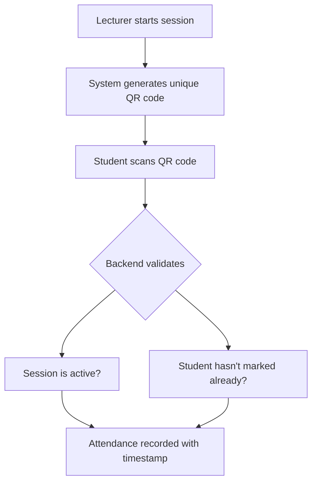

# Digital Student Attendance Tracking & Monitoring System

**Platform:** Hassan Usman Katsina Polytechnic (HUKP)

---

## 1. Product Overview

Build a full-stack digital attendance tracking system that replaces manual paper-based attendance with a QR-code–based, real-time web system.

The system must be implemented entirely using **Next.js (App Router)** with:

- **API Routes** for backend logic
- **MongoDB** as the database
- **NextAuth** for authentication & RBAC
- **shadcn/ui** for UI components
- **Cloudinary** for file uploads (optional future use)

> [!IMPORTANT]
> - Students ALSO use a web application (no mobile app).
> - All users access the system via the browser.

---

## 2. User Roles & Access Control

Implement Role-Based Access Control (RBAC) using NextAuth.

### Roles

| Role | Description |
|------|-------------|
| **ADMIN** | System administrator with full access |
| **LECTURER** | Course instructors who manage attendance sessions |
| **STUDENT** | Students who mark their attendance |

Each user must only access routes and data permitted to their role.

---

## 3. Core Functional Modules

### 3.1 Authentication & Authorization

**Tech:**
- NextAuth (Credentials Provider)
- JWT sessions
- Middleware-based route protection

**Requirements:**
- Login with email + password
- Password hashing (bcrypt)
- Role stored in session
- Protected routes per role
- Admin can create users

---

## 4. Admin Web Application

### Admin Features

- Dashboard overview (stats cards)
- Manage users:
  - Create/edit/delete students & lecturers
- Manage departments
- Manage courses
- Assign lecturers to courses
- View system-wide attendance analytics
- Download attendance reports (CSV/PDF-ready)
- Configure attendance alert thresholds
- System audit log (basic)

### Admin UI

- Tables (shadcn)
- Filters & search
- Modal forms
- Charts (optional)

---

## 5. Lecturer Web Application

### Lecturer Features

- View assigned courses
- View lecture schedule
- Start an attendance session
- Generate time-bound QR code
- View live attendance count
- Close attendance session
- View course attendance history
- Export attendance reports
- Identify low-attendance students

### Attendance Session Rules

- QR code expires automatically
- One attendance per student per session
- Session tied to lecturer + course + timestamp

---

## 6. Student Web Application

### Student Features

- Login via web
- Scan QR code using browser camera
- Mark attendance
- View personal attendance history
- View attendance percentage per course
- Receive attendance warnings (UI-based)

> [!WARNING]
> Use browser-based QR scanning (no native app).

---

## 7. Attendance System Logic

### Attendance Flow



1. Lecturer starts session
2. System generates unique QR code
3. Student scans QR code
4. Backend validates:
   - Session is active
   - Student hasn't marked attendance already
5. Attendance is recorded with timestamp

---

## 8. Database Design (MongoDB)

### Collections

#### users
```json
{
  "_id": "ObjectId",
  "name": "string",
  "email": "string",
  "passwordHash": "string",
  "role": "ADMIN | LECTURER | STUDENT",
  "departmentId": "ObjectId",
  "createdAt": "Date"
}
```

#### departments
```json
{
  "_id": "ObjectId",
  "name": "string"
}
```

#### courses
```json
{
  "_id": "ObjectId",
  "courseCode": "string",
  "title": "string",
  "departmentId": "ObjectId",
  "lecturerId": "ObjectId"
}
```

#### attendanceSessions
```json
{
  "_id": "ObjectId",
  "courseId": "ObjectId",
  "lecturerId": "ObjectId",
  "isActive": "boolean",
  "qrToken": "string",
  "expiresAt": "Date",
  "createdAt": "Date"
}
```

#### attendanceRecords
```json
{
  "_id": "ObjectId",
  "sessionId": "ObjectId",
  "studentId": "ObjectId",
  "markedAt": "Date"
}
```

---

## 9. API Routes (Next.js API)

### Authentication
| Endpoint | Description |
|----------|-------------|
| `/api/auth/*` | NextAuth handlers |

### Admin APIs
| Method | Endpoint | Description |
|--------|----------|-------------|
| POST | `/api/admin/users` | Create user |
| GET | `/api/admin/users` | List users |
| POST | `/api/admin/courses` | Create course |
| POST | `/api/admin/departments` | Create department |

### Lecturer APIs
| Method | Endpoint | Description |
|--------|----------|-------------|
| POST | `/api/lecturer/sessions/start` | Start attendance session |
| POST | `/api/lecturer/sessions/close` | Close attendance session |
| GET | `/api/lecturer/attendance` | Get attendance records |

### Student APIs
| Method | Endpoint | Description |
|--------|----------|-------------|
| POST | `/api/student/attendance/mark` | Mark attendance |
| GET | `/api/student/attendance` | Get personal attendance |

---

## 10. UI & Design Rules

### UI Stack
- **shadcn/ui**
- **Tailwind CSS**
- Dark/light mode support

### Pages
| Route | Description |
|-------|-------------|
| `/login` | Authentication page |
| `/admin/dashboard` | Admin dashboard |
| `/lecturer/dashboard` | Lecturer dashboard |
| `/student/dashboard` | Student dashboard |
| `/student/scan` | QR code scanner |

---

## 11. File Uploads (Cloudinary)

Use only if needed, but system must be ready for:
- Profile pictures
- Course materials (future)

**Requirements:**
- Upload via API route
- Secure Cloudinary credentials

---

## 12. Security Requirements

- JWT-based session validation
- Server-side role checks
- Input validation
- Rate limiting on attendance marking
- Prevent QR reuse or replay attacks

---

## 13. Non-Functional Requirements

| Requirement | Target |
|-------------|--------|
| Concurrent users | 200+ |
| Performance | High performance during lecture hours |
| UI | Mobile-responsive |
| Codebase | Clean folder structure |

---

## Tech Stack Summary

| Layer | Technology |
|-------|------------|
| Framework | Next.js (App Router) |
| Database | MongoDB |
| Authentication | NextAuth (Credentials + JWT) |
| UI Components | shadcn/ui |
| Styling | Tailwind CSS |
| File Storage | Cloudinary (future) |
